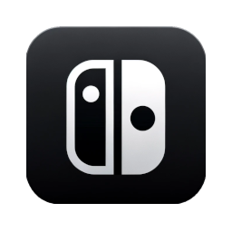
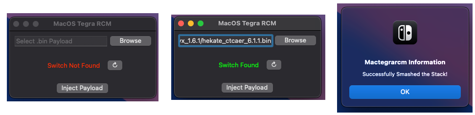
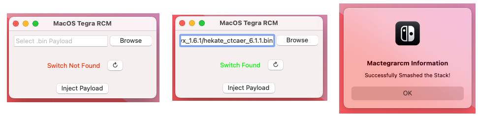

# [Download MacTegraRCM](https://github.com/matthewperiut/MacTegraRcm/releases)

### Important Note: For first launch, *right click* and press open! Then press open again.

# Demo Images

# Features
- Error Detection and Handling
- Save BIN location on successful launch
- Proper .app format
- WxWidgets for native MacOS application appearance
- Static dependencies on WxWidgets and libusb
- Works out of the box!

# Purpose
Desktop Application for MacOS as a simple way to inject a payload into RCM on Nintendo Switch on v1.  
Intended for educational purposes.  

# Building
These instructions are for MacOS, tested on 14.4.1 and 14.5.

Clone & Compile:  
`brew install cmake ninja wxwidgets libusb`  
`git clone https://github.com/matthewperiut/MacTegraRcm`  
`cd MacTegraRcm`  
`mkdir build && cd build`  
`cmake -G Ninja ..`  
`ninja`  
`open .`  
You should see the application! Right click and press open, feel free to move into applications  

# Sharing
If you do intend to compile and share the application, make sure that you use vcpkg wxwidgets and libusb so that you can have static dependencies!

# Special Thanks
Thank you to [@Jan200101](https://github.com/Jan200101) for creating [FuseeC](https://github.com/Jan200101/fuseec) which is utilized in `dep/fuseec`